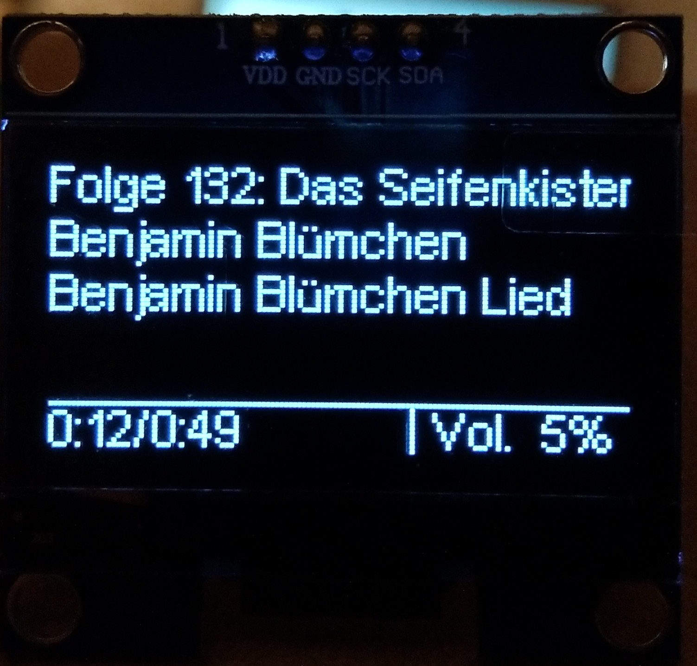

Date: 24.12.2018

# oled_phoniebox
oled_phoniebox
Based on https://github.com/rm-hull/luma.oled

Tested with this display (affiliate Link): <a href="https://amzn.to/2SjPFPt" target="_blank">https://amzn.to/2SjPFPt</a>

| Start Screen | Play View | Pause Screen | Play Screen | Vol Down Screen | Vol Up Screen |
| --- | --- | --- | --- | --- | --- |
|  |  |  |  |  |  |

<a href="https://youtu.be/KXVeuthe45w" target="_blank">German Youtube Video</a>
<a href="https://forum-raspberrypi.de/forum/thread/41465-oled-display-fuer-die-phoniebox/" target="_blank">German Forum</a>

My Phoniebox Project (german only): <a href="https://splittscheid.de/selfmade-phoniebox/" target="_blank">My Selfmade Phoniebox</a>

## Installation Steps

### Installation I2C
Please follow these Instructions: https://learn.adafruit.com/adafruits-raspberry-pi-lesson-4-gpio-setup/configuring-i2c

### Deactivate Buttons
It is possible, that the Display uses the same GPIO like the Shut-Command of the jukebox4kids. In this case, you should edit the file gpio-buttons.py like this
> sed -i -e "s:shut = Button(3, hold_time=2):#shut = Button(3, hold_time=2):g" ~/RPi-Jukebox-RFID/scripts/gpio-buttons.py

### Service Installation
1. Login as User pi
2. sudo apt update
3. sudo apt install -y git 
4. sudo git clone https://github.com/splitti/oled_phoniebox ~/oled_phoniebox
5. cd ~/oled_phoniebox
6. sudo chmod 777 setup.sh
7. sudo ./setup.sh

## Spend me a coffee
<a href="http://paypal.me/splittscheid" target="_blank">paypal.me</a>

## Thank you
Contributors and Testers:
- <a href="https://forum-raspberrypi.de/user/53531-uelly/" target="_blank">uelly</a>

Github:
- <a href="https://github.com/rm-hull/luma.oled" target="_blank">Luma.Oled</a>
- <a href="https://github.com/rm-hull/luma.examples" target="_blank">Luma.Examples</a>
- <a href="https://github.com/MiczFlor/RPi-Jukebox-RFID" target="_blank">RPi-Jukebox-RFID also known as Phoniebox</a>

Image (music.png): 
- https://pixabay.com/de/noten-musik-melodie-musiknote-2570451

Images (cardhand and musiccard) based on:
- https://pixabay.com/de/turm-mikrowelle-wireless-signal-34981/
- https://pixabay.com/de/klavier-noten-musik-klavier-musical-2460937/
- https://pixabay.com/de/hand-karte-halten-angabe-ticket-307636/

Font: 
- https://www.dafont.com/pixel-arial-11.font

