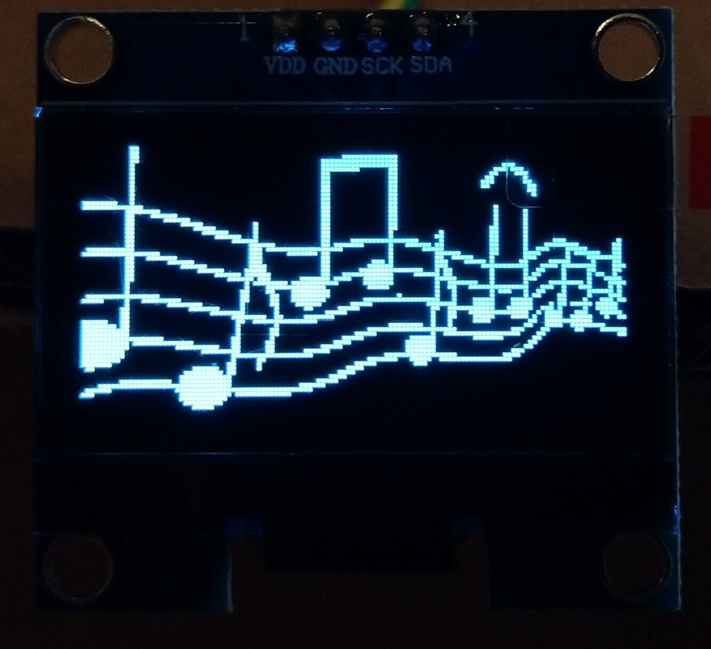
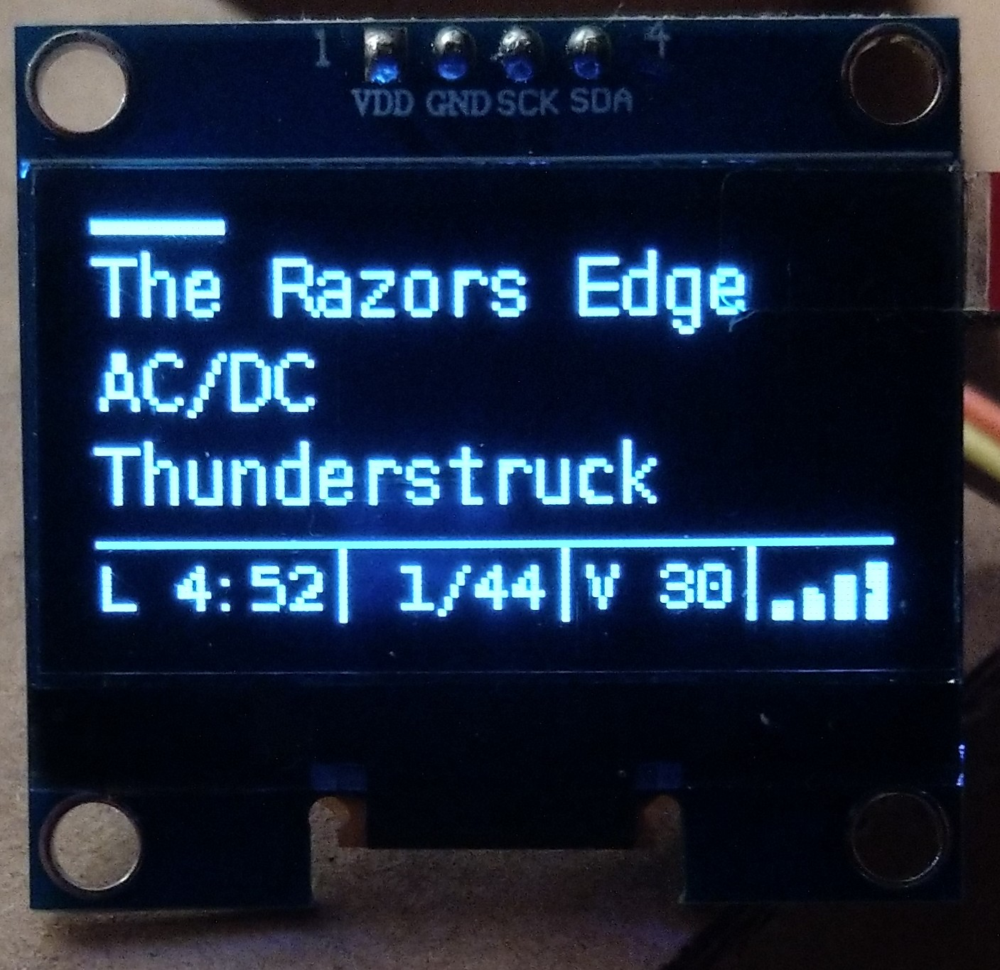
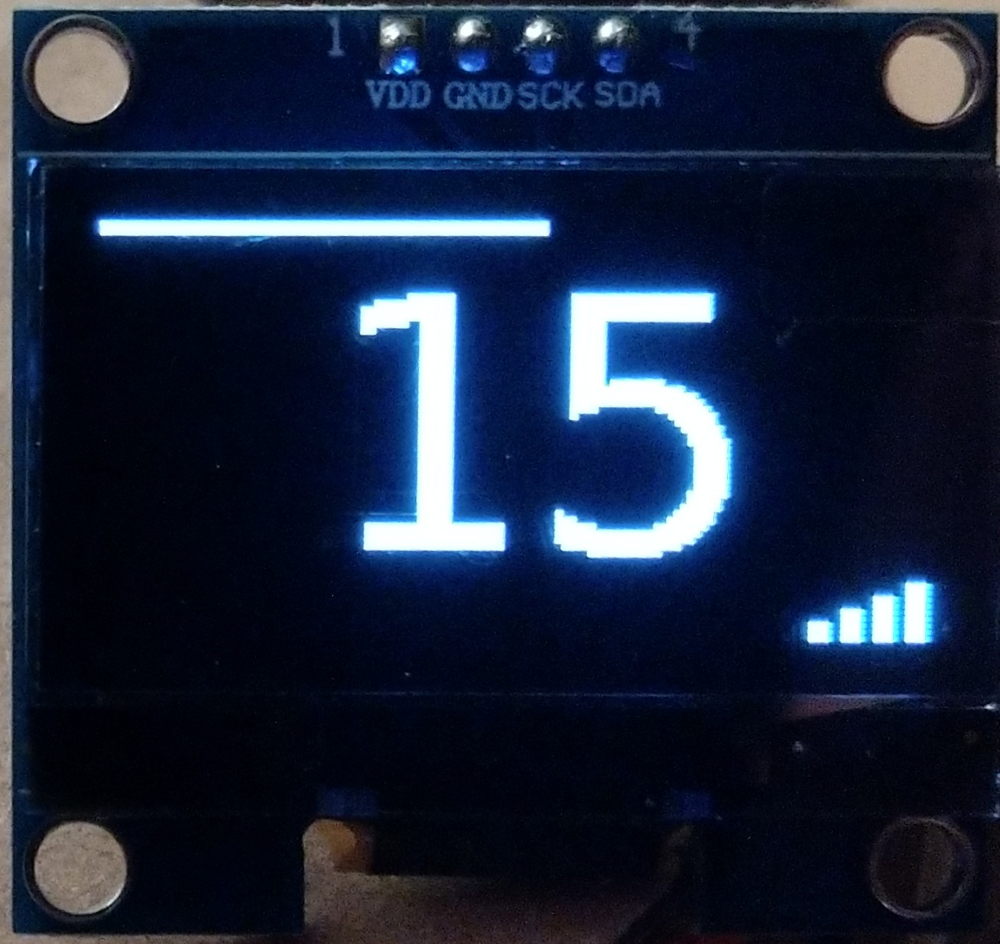
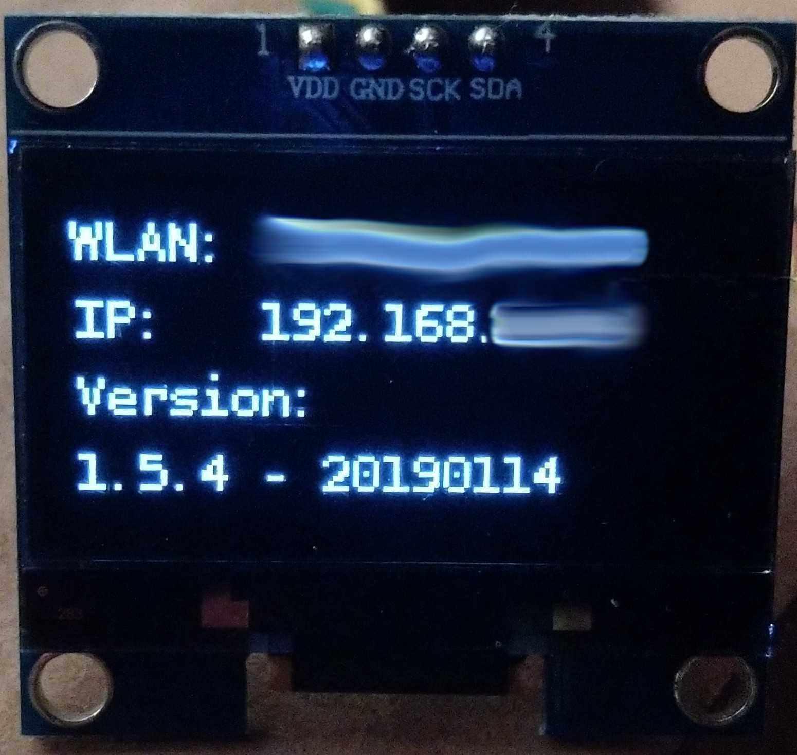
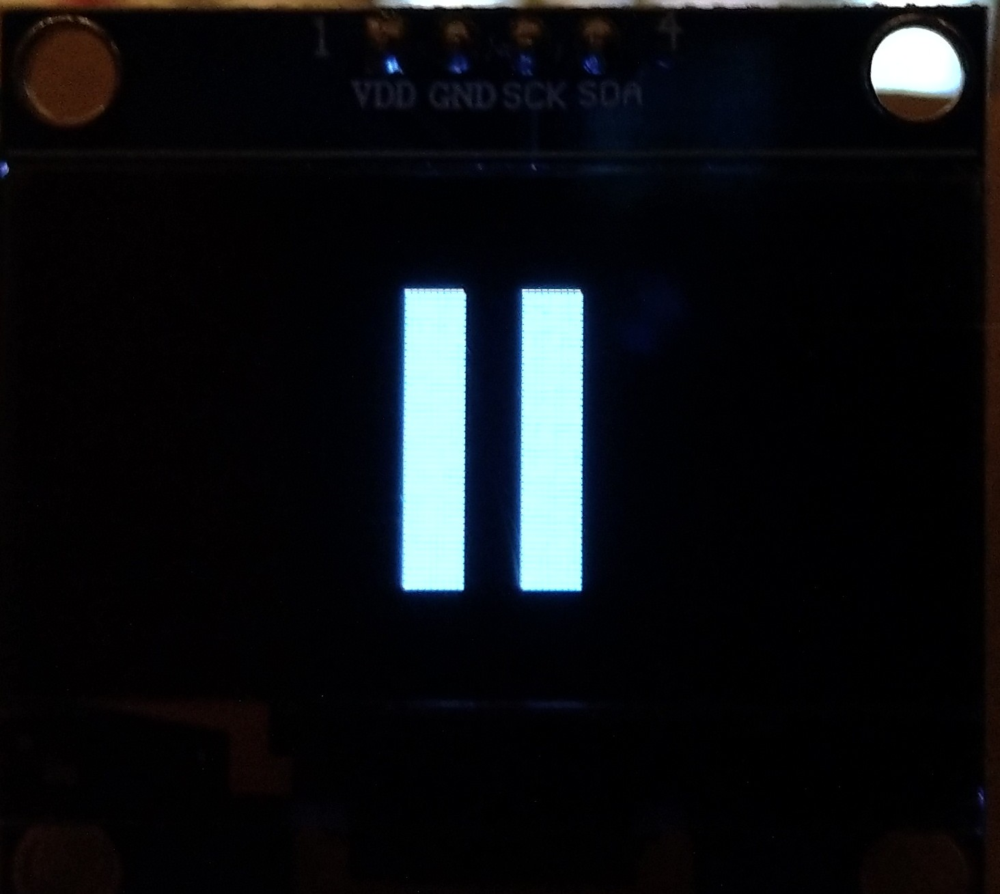
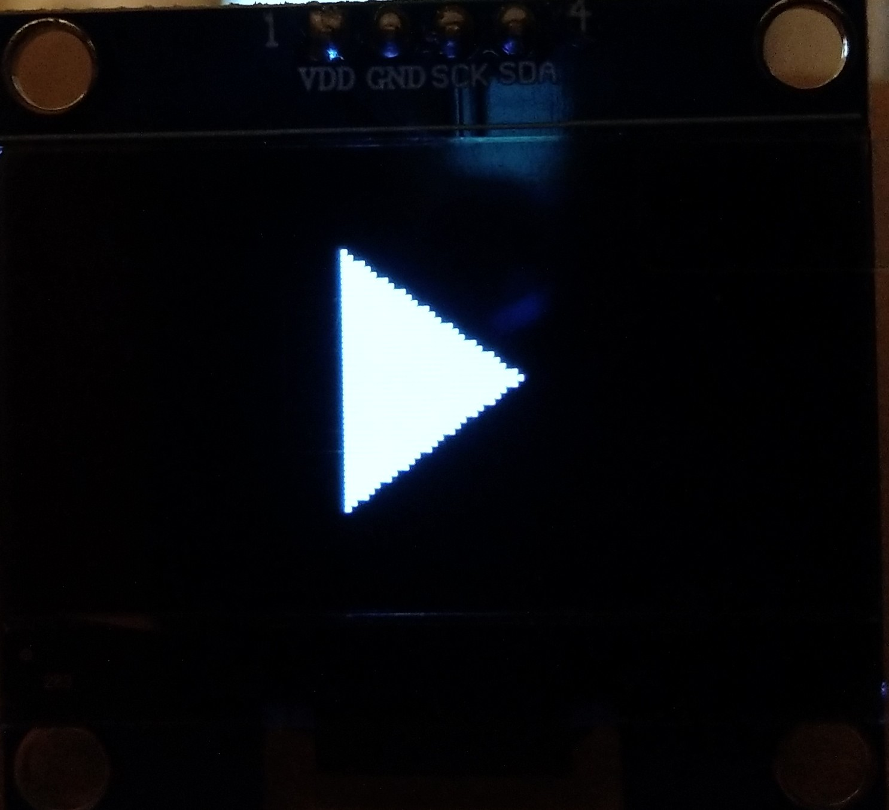
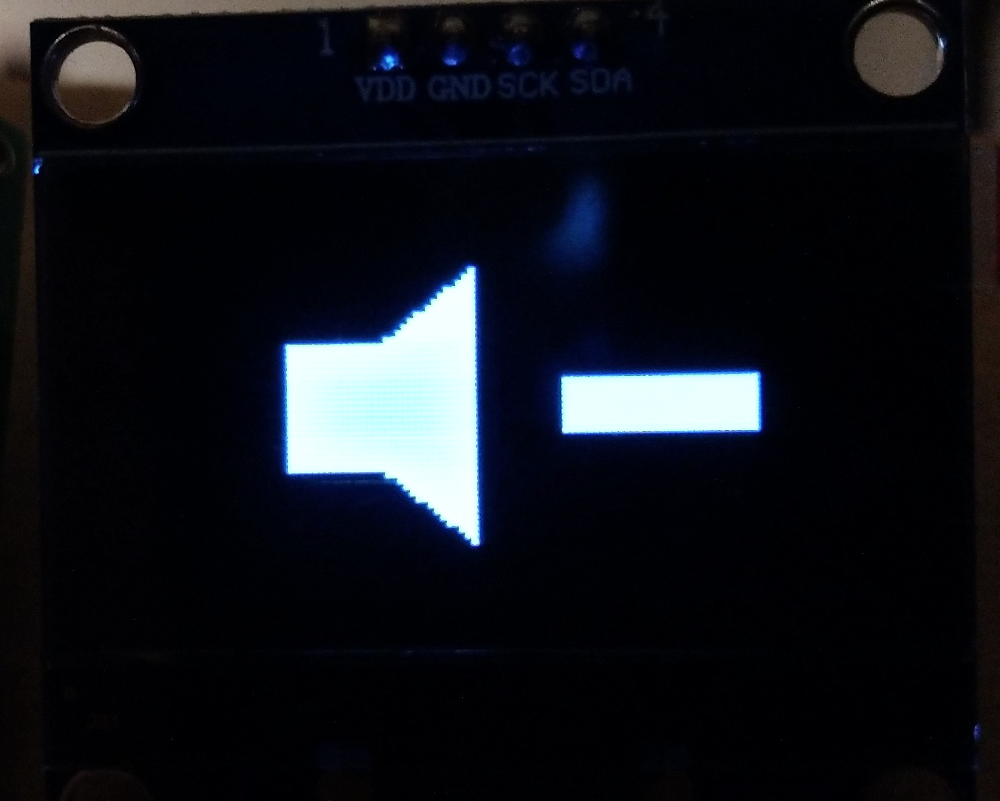
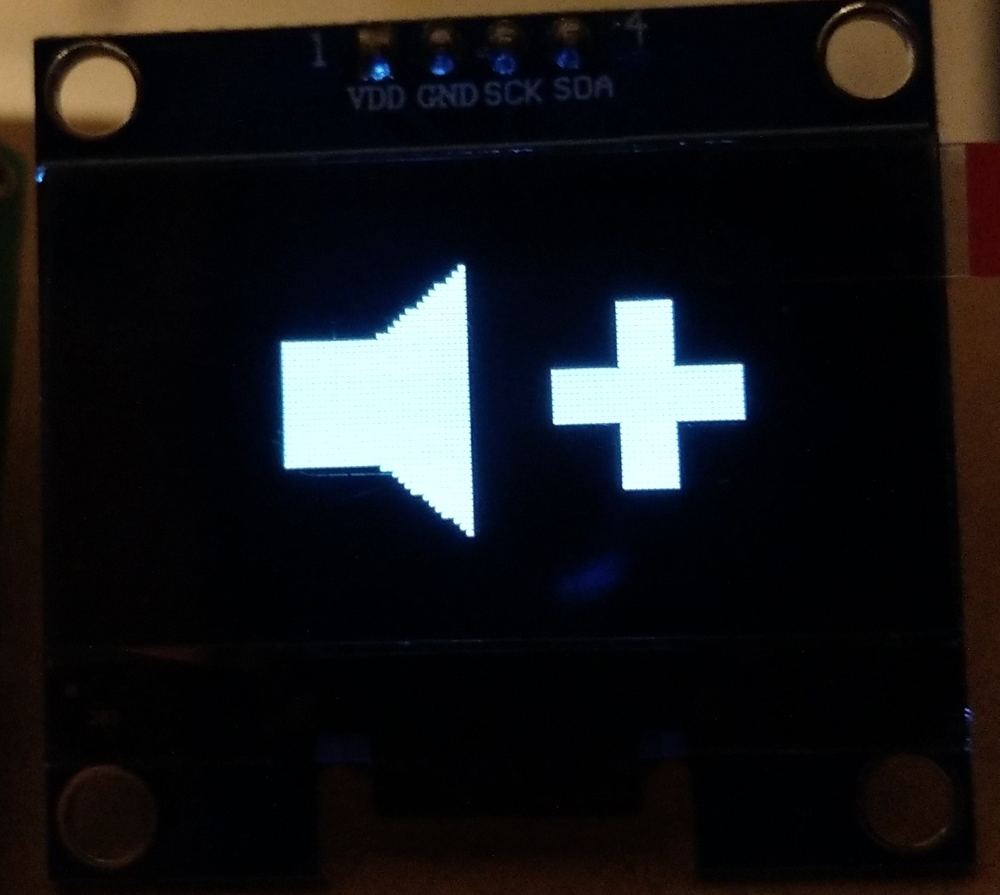

Date: 05.01.2020
Version: 1.9.0 - 20200105

# oled_phoniebox
oled_phoniebox
Based on https://github.com/rm-hull/luma.oled

Tested with this display (affiliate Link): <a href="https://amzn.to/2SjPFPt" target="_blank">https://amzn.to/2SjPFPt</a>

| Start Screen | Play View Full | Play View Lite | Info Screen | Pause Screen | Play Screen | Vol Down Screen | Vol Up Screen |
| --- | --- | --- | --- | --- | --- | --- | --- |
|  |  |  |  |  |  |  |  |

My finished Box on Youtube: <a href="https://youtu.be/GpHAbM0JIt4" target="_blank">Die drei ??? Kids Phoniebox</a>
Youtube Information Video: <a href="https://youtu.be/bEJN0BWdAXY" target="_blank">German Youtube Video</a>
Forum: <a href="https://forum-raspberrypi.de/forum/thread/41465-oled-display-fuer-die-phoniebox/" target="_blank">German Forum</a>

My Phoniebox Project (german only): <a href="https://splittscheid.de/selfmade-phoniebox/" target="_blank">My Selfmade Phoniebox</a>

## Installation Steps

### Installation I2C
Please follow these Instructions: https://learn.adafruit.com/adafruits-raspberry-pi-lesson-4-gpio-setup/configuring-i2c

### Deactivate Buttons
It is possible, that the Display uses the same GPIO like the Shut-Command of the jukebox4kids. In this case, you should edit the file gpio-buttons.py like this
> sed -i -e "s:shut = Button(3, hold_time=2):#shut = Button(3, hold_time=2):g" ~/RPi-Jukebox-RFID/scripts/gpio-buttons.py

### Service Installation
Please notice:
This installer will install in the home-Directory of the user pi in the subfolder oled_phoniebox. If you try to rename or move this folder, the service stops working.
Run the following code with the user pi:

> cd; rm o4p_installer.sh; wget https://raw.githubusercontent.com/splitti/oled_phoniebox/master/scripts/install/o4p_installer.sh; chmod +x o4p_installer.sh; ./o4p_installer.sh

### Contrast Control
You can add Contrast Control while editing the ~/RPi-Jukebox-RFID/scripts/gpio-buttons.py. You can find an example here: <a href="https://github.com/splitti/oled_phoniebox/tree/master/scripts/gpio-buttons" target="_blank">https://github.com/splitti/oled_phoniebox/tree/master/scripts/gpio-buttons</a>
Add a Button press and start these commands:
> python3 ../oled_phoniebox/scripts/contrast/contrast_up.py
> python3 ../oled_phoniebox/scripts/contrast/contrast_down.py

### Just another Feature
Press Prev- and Next-Button together for two or more seconds, and you get some Information about your WiFi and the installed oled_phoniebox-Version. If you press the buttons again, you can change the Display-Mode.

## Spend me a coffee
<a href="http://paypal.me/splittscheid" target="_blank">paypal.me</a>

## FAQ
How can i switch between lite or full version?
- Press and hold Next and Prev together for 2 seconds or more. The Information Screens will be displayed. Press and hold Next and Prev again for 2 seconds and the mode will be changed.

How should i update the oled_phoniebox?
- This time, the only way is to run the installer again, because there are different changes in the file-system. git pull does not work here!

## Thank you
Contributors and Testers:
- <a href="https://forum-raspberrypi.de/user/53531-uelly/" target="_blank">uelly</a>
- <a href="https://forum-raspberrypi.de/user/53205-carver/" target="_blank">carver</a>

Github:
- <a href="https://github.com/rm-hull/luma.oled" target="_blank">Luma.Oled</a>
- <a href="https://github.com/rm-hull/luma.examples" target="_blank">Luma.Examples</a>
- <a href="https://github.com/MiczFlor/RPi-Jukebox-RFID" target="_blank">RPi-Jukebox-RFID also known as Phoniebox</a>

Image (music.png):
- https://pixabay.com/de/noten-musik-melodie-musiknote-2570451

Images (cardhand and musiccard) based on:
- https://pixabay.com/de/turm-mikrowelle-wireless-signal-34981/
- https://pixabay.com/de/klavier-noten-musik-klavier-musical-2460937/
- https://pixabay.com/de/hand-karte-halten-angabe-ticket-307636/
- https://pixabay.com/de/herunterfahren-macht-off-auf-icon-2935465/

Font:
- https://www.dafont.com/bitstream-vera-mono.font
- https://www.dafont.com/wifi.font

## Changelog
- 05.01.2020 - 1.9.0 - 20200105
  - Bugfix:
      - Code review
- 02.01.2020 - 1.8.4 - 20200102
  - Bugfix:
      - The Phyton Package phyton-imaageing was replaced by python-pil; see also <a href="https://github.com/rm-hull/luma.oled" target="_blank">issue 5</a>
  - Featues:
      - Boot speed improvement. Reinstall necessary!
- 26.06.2019 - Version 1.8.3 - 20190626
  - Features:
    - New Mixed Mode
	- Special Button Hint optimized
	- Shorter Duration Time of Status like Play, Vol Up/Down
- 31.01.2019 - Version 1.7.1 - 20190131
  - Bugfix:
    - The information on the radio stream was not displayed correctly: fixed (Issue: <a href="https://github.com/splitti/oled_phoniebox/issues/2#issuecomment-456209931">https://github.com/splitti/oled_phoniebox/issues/2#issuecomment-456209931</a>)
    - Fixing some small errors
  - Features:
    - Mute Image
    - Radio Image (new Font added)
- 18.01.2019 - Version 1.6.2 - 20190118
  - Bugfix: One Line Install-Script
- 16.01.2019 - Version 1.6.1 - 20190116
  - Change mode without shell or installation
- 13.01.2019 - Version 1.5.3 - 20190113
  - Bugfix:
    - Wifi
    - Button Replacement
  - Features:
    - New updated Scrolling (Letter Scrolling)
	- Wifi gets a new view
- 11.01.2019 - Version 1.3.6
  - Bugfixing
  - Code optimized
  - Lite and Full Display Version (like parent and kids-mode)
  - Contrast-Control Installation
  - I2C Installation
  - New Button Control Installation
  - Special Button Hint: Press Prev + Next for more then two seconds and you get some informations...
- 10.01.2019
  - New One Line Setup
  - Removed Luma Examples; Function integrated
- 09.01.2019
  - Bugfixing WLAN
  - Contrast Control Tutorial with GPIO-Button-Control
- 05.01.2019
  - Contrast Control added
- 04.01.2019
  - WiFi-Signal
  - Monospaced Font
  - New Track View
  - Play bar 0 - 100%
- 01.01.2019
  - Shutdown Image
- 30.12.2018
  - Added Text scrolling
  - Added Tracknr.
  - New Screens optimized
- 29.12.2018
  - Python 3 Support
  - New Screens
  - Setup Bugfixes
